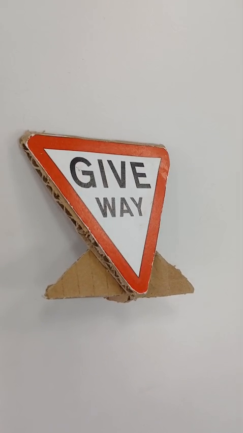
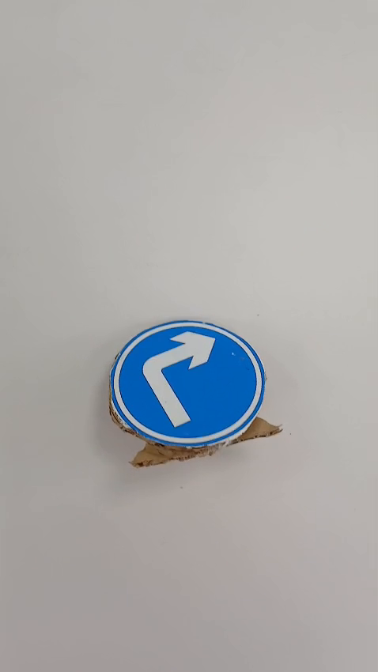
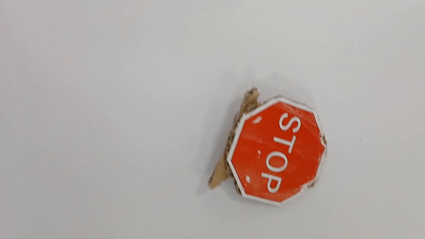
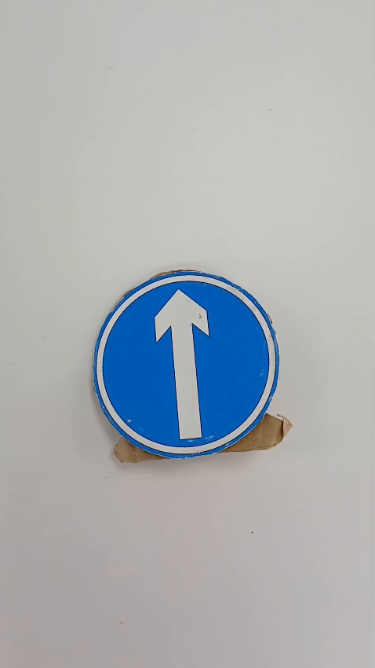
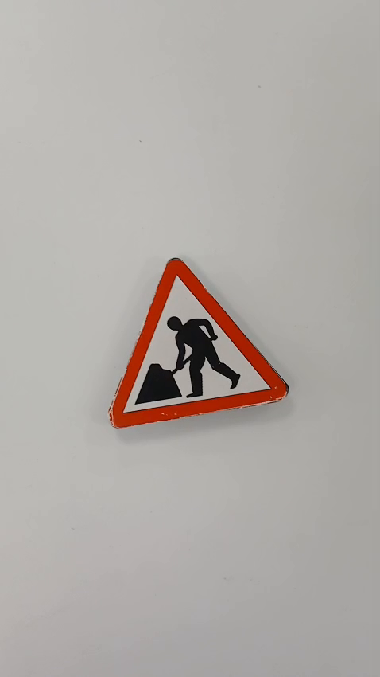

# Dataset Generation & YOLO Training

Traffic sign detection pipeline for the TE3002B course. Generates synthetic data by compositing segmented sign crops onto random backgrounds, then trains a YOLOv8 model to detect 5 classes in real time via ROS2.

---

## Classes

| ID | Name | Description |
|----|------|-------------|
| 0 | `away` | Keep-away / no-entry sign |
| 1 | `direction` | Directional arrow sign |
| 2 | `stop` | Stop sign |
| 3 | `straight` | Go-straight sign |
| 4 | `workers` | Workers-ahead sign |

Test image samples:

| away | direction | stop | straight | workers |
|------|-----------|------|----------|---------|
|  |  |  |  |  |

---

## Pipeline

```
Record video  →  extract_frames.py  →  manual cleanup
    →  segmentation_image.py  →  generate_yolo_dataset.py  →  train_yolo.py
```

### Step 1 — Record & extract frames
Record videos of each sign class with the robot camera, then extract individual frames:
```bash
python3 extract_frames.py
```
Frames land in `dataset_cleaned/<class>/`.

### Step 2 — Manual cleanup
Delete frames where the sign is not clearly visible, heavily occluded, or motion-blurred.
Blur detection (Laplacian variance < 100) automates part of this.

### Step 3 — Segmentation
Isolate the sign from its background to produce transparent-background crops:
```bash
python3 segmentation_image.py
```
Output goes to `dataset_segmented/<class>/` (~1 189 crops across all classes).

Segmented crop counts per class:

| away | direction | stop | straight | workers |
|------|-----------|------|----------|---------|
| 444 | 127 | 134 | 216 | 268 |

### Step 4 — Synthetic dataset generation
Composite each crop onto random backgrounds from `backgrounds/` at varying scales, positions, and augmentations to produce YOLO-format images + labels:
```bash
python3 generate_yolo_dataset.py
```
Output: `dataset_ultra/` — **8 000 train** / **2 000 eval** images with YOLO bounding-box labels.

Example generated training images:


### Step 5 — Training
```bash
python3 train_yolo.py
```
Trains `yolo26s.pt` for 100 epochs on a single GPU (`device=0`).  
Weights are saved to `./runs/detect/señales_trafico/weights/`:
- `best.pt` — best validation checkpoint
- `last.pt` — final epoch checkpoint

Training config:

| Parameter | Value |
|-----------|-------|
| Base model | yolo26s |
| Epochs | 100 |
| Image size | 640 |
| Batch | auto (`-1`) |
| LR₀ | 0.01 |
| Conf threshold | 0.74 |

---

### Live ROS2 inference
```bash
python3 yolo_detector_node.py
```
Subscribes to `/Image` (`sensor_msgs/msg/Image`), filters blurry frames, draws bounding boxes in real time, and optionally records a video.

Key constants at the top of `yolo_detector_node.py`:

| Constant | Default | Description |
|----------|---------|-------------|
| `TOPIC` | `/Image` | ROS2 image topic |
| `CONF` | `0.74` | Confidence threshold |
| `BLUR_THRESHOLD` | `10.0` | Laplacian variance — frames below this are skipped |
| `MIN_BOX` | `30` | Minimum bounding-box side in pixels |
| `SAVE_VIDEO` | `False` | Set `True` to record annotated output to `VIDEO_PATH` |
| `VIDEO_PATH` | `detection_output.mp4` | Output video file |
| `VIDEO_FPS` | `20` | Recording frame rate |

> `cv_bridge` is **not** used — the `sensor_msgs/Image` → OpenCV conversion is done manually with NumPy to avoid a NumPy 1.x/2.x ABI conflict.

---

## File structure

```
dataset_generation/
├── backgrounds/          # Background images for compositing
├── dataset_cleaned/      # Raw extracted frames after manual cleanup
│   └── <class>/
├── dataset_segmented/    # Transparent-background sign crops
│   └── <class>/
├── dataset_ultra/        # Final YOLO dataset (generated)
│   ├── images/train/     # 8 000 images
│   ├── images/eval/      # 2 000 images
│   └── labels/
├── Test_images/          # One reference image per class
├── data.yaml             # YOLO dataset config
├── extract_frames.py     # Frame extraction from video
├── generate_dataset.py   # Earlier dataset generator
├── generate_yolo_dataset.py  # Final YOLO-format generator
├── segmentation_image.py # Sign segmentation
├── train_yolo.py         # Training script
├── test_yolo.py          # Offline inference + visualization
└── yolo_detector_node.py # ROS2 real-time detection node
```
